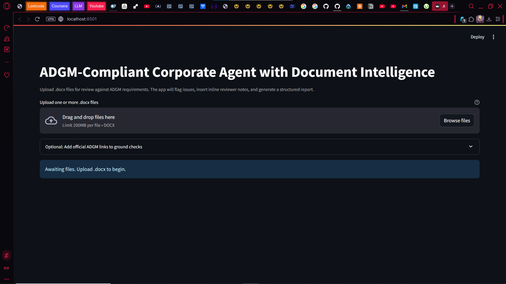
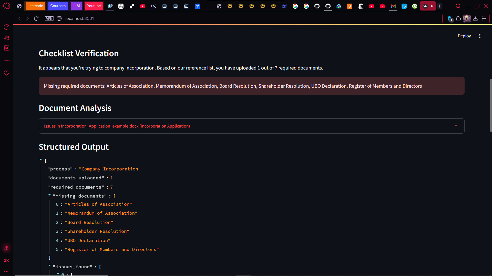
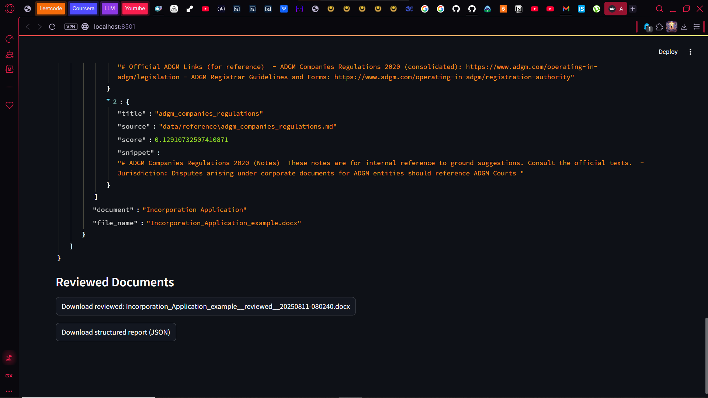
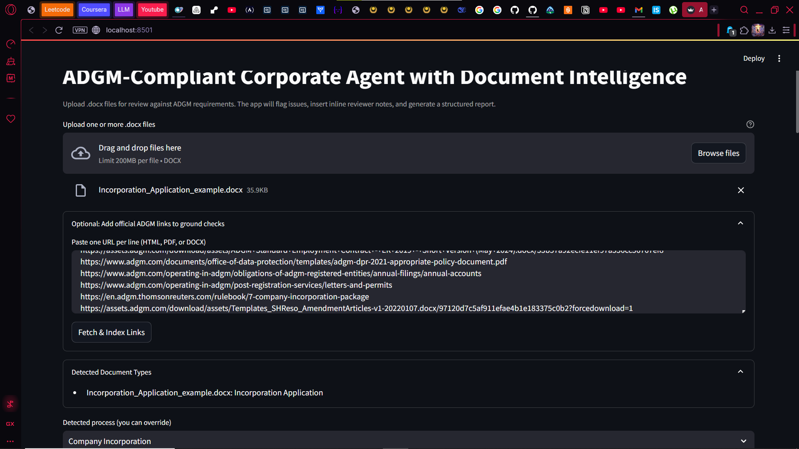

# ADGM Corporate Agent (Document Intelligence)

An AI-powered reviewer for ADGM corporate documents. It checks completeness against ADGM checklists, flags red flags, inserts comments into `.docx`, and produces a structured report.

## Key Features

- **.docx upload and parsing**: Upload one or more `.docx` files; text is parsed from paragraphs and tables.
- **Auto document typing**: Heuristic classifier maps files to types (AoA, MoA, Board/Shareholder Resolution, Application, UBO, Registers, etc.).
- **Process inference**: Infers likely process (e.g., Company Incorporation) from the uploaded set; you can override.
- **Checklist verification**: Compares present document types against the required ADGM checklist and shows missing items.
- **Red-flag detection**: Heuristics for ADGM jurisdiction, ambiguous language, execution sections, AoA share capital, length sanity, and more.
- **Inline review notes**: Adds Word comments where supported; otherwise adds inline reviewer notes in the document.
- **RAG grounding**: Uses a TF‑IDF retriever over `data/reference/` and optional “official links” you paste to ground findings and suggestions with citations/snippets.
- **Optional LLM suggestions**: If `OPENAI_API_KEY` is set, generates concise clause fixes aligned with ADGM context.
- **Downloadables**: One reviewed `.docx` per upload, plus a consolidated JSON report capturing process, counts, missing docs, and issues.
- **Headless CLI**: Script to review a folder of `.docx` files and save outputs without the UI.

## Quickstart

1. Create and activate a virtual environment, then install dependencies:

```bash
python -m venv .venv
. .venv/Scripts/activate  # Windows PowerShell: .venv\Scripts\Activate.ps1
pip install -r requirements.txt
```

2. (Optional) Set OpenAI for suggestions:

```bash
setx OPENAI_API_KEY "your_api_key_here"
setx OPENAI_MODEL "gpt-4o-mini"
```

3. Run the app:

```bash
streamlit run app.py
```

Open the local URL shown in the terminal.

### Optional: URL ingestion for grounding

- Expand “Optional: Add official ADGM links” in the app
- Paste one URL per line (HTML / PDF / DOCX) from official sources
- Click “Fetch & Index Links” to add them to the retriever

## Usage

- Upload one or more `.docx` files
- Review the detected document types
- Confirm or change the inferred process (e.g., Company Incorporation)
- Review checklist results and issues
- Download the reviewed `.docx` files and JSON report

## Screenshots (Overview)

1) Dashboard and uploads



- Upload `.docx` files, see detected types, and confirm/override the inferred process.

2) Checklist verification



- Shows how many required documents are present vs. missing for the selected ADGM process.

3) Reviewed documents and JSON report



- Download the marked-up `.docx` files with inline comments/notes and the consolidated JSON report.

4) Example test run



- Demonstrates end-to-end flow with sample documents provided in `examples/`.

## Reference Data (RAG)

Place your ADGM reference notes in `data/reference/*.txt` or `*.md`. A simple TF-IDF retriever surfaces the most relevant notes per issue.

You can also paste official ADGM URLs in the UI. The app fetches and extracts text from HTML/PDF/DOCX and extends the retriever with these sources.

## Example Files

- Add an example source `.docx` and the corresponding reviewed version into `examples/` after running the app for demo purposes.

Generate basic examples:

```bash
python scripts/generate_sample_docx.py
```

Headless review of a folder:

```bash
$env:PYTHONPATH = (Get-Location).Path
python scripts/review_folder.py review examples --out out
```

## Submission Checklist

- GitHub repository or zip this folder
- Include one example docx before/after review in `examples/`
- Include the generated JSON report
- Include a screenshot of the UI

## Notes

- Comment insertion in `.docx` is implemented with low-level XML and may vary across document templates. If a paragraph match is not found, a comment is added at the beginning of the document. If your environment does not support Word comments, the app falls back to inserting reviewer-note paragraphs.
- Heuristics are conservative; extend rules in `corporate_agent/red_flags.py` and add more checklist items in `corporate_agent/checklists.py`.